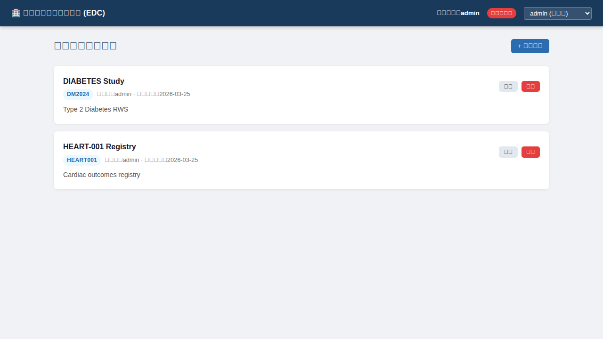
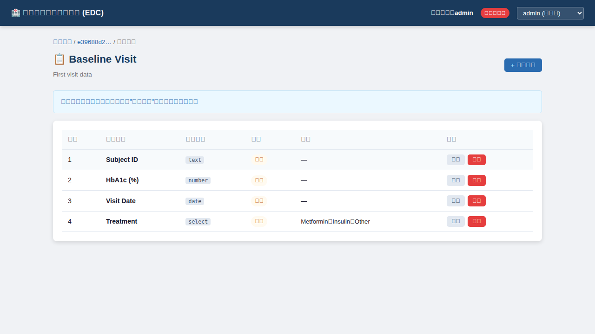
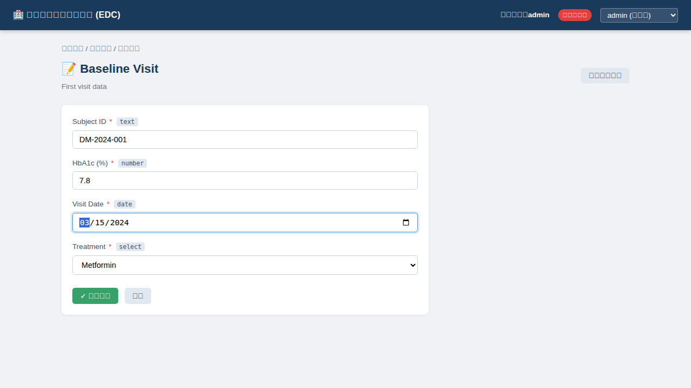
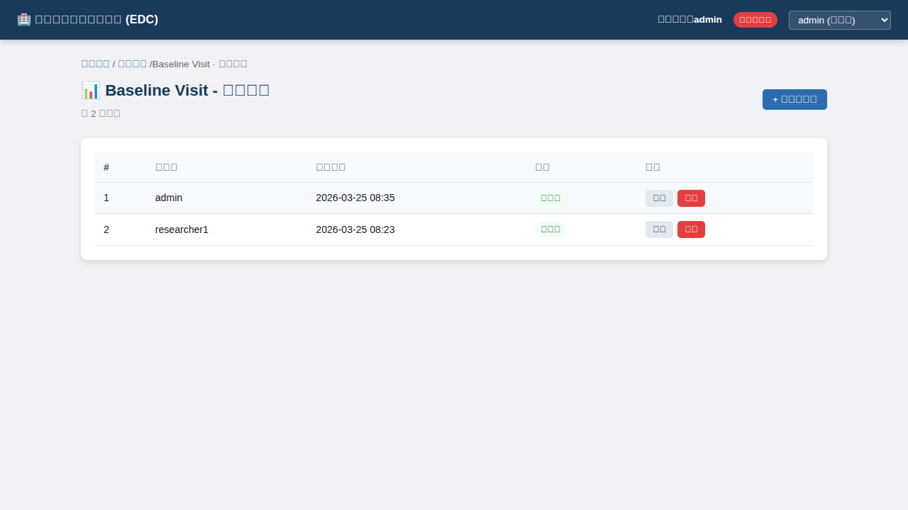

# 临床研究数据管理系统 (EDC / eCRF)

> 一个可在小范围内部真实工作环境中使用的临床研究电子数据采集原型系统，适用于真实世界研究（RWS）和研究者发起研究（IIT）场景。

---

## 📸 界面预览

| 研究项目列表 | 表单设计器 |
|:-----------:|:---------:|
|  |  |

| 数据录入 | 数据记录列表 |
|:-------:|:----------:|
|  |  |

---

## 🚀 快速上手：如何打开用户界面

**方式一：Docker（推荐，无需安装 Node.js）**

```bash
# 安装 Docker Desktop 后，在项目根目录运行：
docker-compose up --build

# 浏览器访问：http://localhost:3001
```

**方式二：一键启动脚本（需要 Node.js ≥ 22.5）**

```bash
bash start.sh

# 浏览器访问：http://localhost:3001
```

启动成功后，在浏览器中打开 **http://localhost:3001** 即可看到用户界面。

> 💡 默认以管理员身份登录（admin）。右上角下拉菜单可切换用户（researcher1 / crc1）。
>
> ⚠️ **注意**：本系统使用基于 `x-user-id` 请求头的演示身份认证，仅适用于受信任的内网环境。**请勿在公共网络或生产环境中直接部署，否则任何人都可以切换身份访问所有数据。**

---

## 一、项目目录结构

```
.
├── backend/                   # 后端（Node.js + Express + SQLite）
│   ├── src/
│   │   ├── server.js          # 主入口，Express 应用
│   │   ├── db/
│   │   │   └── database.js    # SQLite 初始化与 Schema DDL
│   │   ├── middleware/
│   │   │   └── auth.js        # 认证/授权中间件（基于 x-user-id）
│   │   └── routes/
│   │       ├── projects.js    # 研究项目 CRUD
│   │       ├── forms.js       # 表单定义 & 字段定义 CRUD
│   │       ├── entries.js     # 数据录入 & 查询
│   │       └── users.js       # 用户列表
│   └── package.json
│
├── frontend/                  # 前端（React + Vite）
│   ├── src/
│   │   ├── main.jsx           # React 入口
│   │   ├── App.jsx            # 路由配置
│   │   ├── index.css          # 全局样式
│   │   ├── api/
│   │   │   └── client.js      # 统一 API 调用层（fetch wrapper）
│   │   ├── components/
│   │   │   └── Navbar.jsx     # 顶部导航栏（含用户切换）
│   │   └── pages/
│   │       ├── ProjectList.jsx   # 研究项目列表
│   │       ├── ProjectDetail.jsx # 项目详情 + 表单列表
│   │       ├── FormBuilder.jsx   # 表单设计器（管理员）
│   │       ├── DataEntry.jsx     # 动态表单录入
│   │       ├── EntryList.jsx     # 数据记录列表
│   │       └── EntryDetail.jsx   # 单条记录详情
│   └── package.json
│
├── data/                      # SQLite 数据文件（运行时自动创建）
│   └── edc.db
│
├── Dockerfile                 # Docker 镜像构建文件
├── docker-compose.yml         # Docker Compose 一键启动
├── start.sh                   # 一键启动脚本（Node.js 本地运行）
└── README.md
```

---

## 二、数据库表结构

### `users` — 用户表
| 字段 | 类型 | 说明 |
|------|------|------|
| user_id | TEXT PK | 用户唯一ID |
| username | TEXT | 用户名 |
| role | TEXT | `admin` / `user` |
| created_at | TEXT | 创建时间 |

预置用户：`admin`（超级管理员）、`researcher1`（研究者）、`crc1`（CRC）

---

### `projects` — 研究项目
| 字段 | 类型 | 说明 |
|------|------|------|
| project_id | TEXT PK | UUID |
| project_name | TEXT | 项目名称 |
| project_code | TEXT UNIQUE | 项目编号（大写字母+数字） |
| description | TEXT | 项目描述 |
| created_at | TEXT | 创建时间 |
| created_by | TEXT | 创建人 |

---

### `forms` — 表单定义
| 字段 | 类型 | 说明 |
|------|------|------|
| form_id | TEXT PK | UUID |
| project_id | TEXT FK | 所属项目 |
| form_name | TEXT | 表单名称 |
| description | TEXT | 描述 |
| created_at | TEXT | 创建时间 |
| created_by | TEXT | 创建人 |

---

### `form_fields` — 字段定义
| 字段 | 类型 | 说明 |
|------|------|------|
| field_id | TEXT PK | UUID |
| form_id | TEXT FK | 所属表单 |
| field_label | TEXT | 显示名称 |
| field_type | TEXT | `text`/`number`/`date`/`radio`/`checkbox`/`select`/`textarea` |
| required | INTEGER | 是否必填（0/1） |
| options | TEXT | JSON 数组（适用于 radio/checkbox/select） |
| display_order | INTEGER | 排列顺序 |
| created_at | TEXT | 创建时间 |

---

### `form_entries` — 数据录入记录
| 字段 | 类型 | 说明 |
|------|------|------|
| entry_id | TEXT PK | UUID |
| project_id | TEXT FK | 所属项目 |
| form_id | TEXT FK | 所属表单 |
| submitted_by | TEXT | 录入人 |
| submitted_at | TEXT | 录入时间 |
| status | TEXT | `draft` / `submitted` |

---

### `form_entry_values` — 字段值
| 字段 | 类型 | 说明 |
|------|------|------|
| value_id | TEXT PK | UUID |
| entry_id | TEXT FK | 所属记录 |
| field_id | TEXT FK | 对应字段 |
| field_value | TEXT | 字段值（checkbox 为 JSON 数组字符串） |

---

## 三、API 说明

所有请求需携带 `x-user-id` 请求头（演示版身份认证）。

| 方法 | 路径 | 权限 | 功能 |
|------|------|------|------|
| GET | `/api/health` | 无需认证 | 健康检查 |
| GET | `/api/users` | 任意用户 | 获取用户列表 |
| GET | `/api/projects` | 任意用户 | 获取所有项目 |
| POST | `/api/projects` | 管理员 | 创建项目 |
| PUT | `/api/projects/:id` | 管理员 | 编辑项目 |
| DELETE | `/api/projects/:id` | 管理员 | 删除项目 |
| GET | `/api/projects/:id/forms` | 任意用户 | 获取项目下表单列表 |
| POST | `/api/projects/:id/forms` | 管理员 | 创建表单 |
| GET | `/api/forms/:formId` | 任意用户 | 获取表单+字段 |
| PUT | `/api/forms/:formId` | 管理员 | 编辑表单 |
| DELETE | `/api/forms/:formId` | 管理员 | 删除表单 |
| POST | `/api/forms/:formId/fields` | 管理员 | 添加字段 |
| PUT | `/api/forms/:formId/fields/:fieldId` | 管理员 | 编辑字段 |
| DELETE | `/api/forms/:formId/fields/:fieldId` | 管理员 | 删除字段 |
| GET | `/api/forms/:formId/entries` | 任意用户 | 获取录入记录列表 |
| POST | `/api/forms/:formId/entries` | 任意用户 | 提交数据录入 |
| GET | `/api/entries/:entryId` | 任意用户 | 获取记录详情（含字段值） |
| DELETE | `/api/entries/:entryId` | 管理员 | 删除记录 |

---

## 四、数据从前端写入 SQLite 的完整执行路径

以"研究者提交一条数据记录"为例：

```
1. [前端 DataEntry.jsx]
   用户填写表单字段 → handleSubmit() 触发客户端校验
   → 调用 submitEntry(formId, { values, status:'submitted' })

2. [前端 api/client.js]
   apiFetch('/forms/{formId}/entries', {method:'POST', body:JSON.stringify({values, status})})
   携带 x-user-id 请求头 → 发送 HTTP POST 到 /api/forms/{formId}/entries

3. [后端 Express 路由 routes/entries.js]
   requireAuth 中间件：读取 x-user-id → 查询 users 表验证身份 → 附加 req.user
   → 查询对应 forms 表（确认表单存在）
   → 查询 form_fields 表（获取全部字段定义）

4. [后端 数据校验]
   for each field:
     - 检查必填字段是否有值
     - 校验 number 类型
     - 校验 date 格式
     - 校验 radio/select 值是否在选项范围内
     - 校验 checkbox 选项合法性
   - 拒绝未知 field_id（防止非法字段写入）
   → 如有错误：返回 422 + 详细错误列表

5. [后端 事务写入 SQLite]
   BEGIN TRANSACTION
   → INSERT INTO form_entries (entry_id, project_id, form_id, submitted_by, status)
   → for each field value:
        INSERT INTO form_entry_values (value_id, entry_id, field_id, field_value)
   COMMIT

6. [后端 响应]
   返回 201 + 新建的 entry 对象（JSON）

7. [前端 DataEntry.jsx]
   setSubmitted(true) → 显示"录入成功"界面
   提供"继续录入"或"查看记录"按钮
```

---

## 五、快速启动

### 方式一：Docker（推荐，无需本地安装 Node.js）

```bash
# 构建并启动
docker-compose up --build

# 浏览器访问：http://localhost:3001
```

> 数据持久化存储在 Docker volume `edc-data` 中，停止容器后数据不会丢失。

---

### 方式二：一键脚本（本地 Node.js）

**环境要求：** Node.js ≥ 22.5，npm ≥ 9

```bash
# 在项目根目录执行
bash start.sh

# 浏览器访问：http://localhost:3001
```

---

### 方式三：手动分步启动（开发调试）

```bash
# 终端 1 – 启动后端（端口 3001）
cd backend && npm install
node src/server.js

# 终端 2 – 启动前端开发服务器（端口 3000，含热重载）
cd frontend && npm install
npm run dev
# 浏览器访问：http://localhost:3000
```

---

### 默认预置用户

| user_id | username | 角色 |
|---------|----------|------|
| admin-001 | admin | 超级管理员 |
| user-001 | researcher1 | 研究者 |
| user-002 | crc1 | CRC |

前端右上角下拉菜单可切换用户身份（演示用）。

---

## 六、架构说明

```
┌────────────────────────┐
│   浏览器 (React SPA)    │  ← 前端：只渲染 UI，不含业务逻辑
│   localhost:3000        │
└───────────┬────────────┘
            │ HTTP/JSON (x-user-id header)
            ▼
┌────────────────────────┐
│   Express API Server   │  ← 后端：路由 + 校验 + 业务逻辑
│   localhost:3001        │
└───────────┬────────────┘
            │ node:sqlite
            ▼
┌────────────────────────┐
│   SQLite (data/edc.db) │  ← 数据层：持久化存储
└────────────────────────┘
```

数据流向：UI → HTTP Request → Backend API → SQLite
前端从不直接访问数据库。
